# DevOps
## Mehr als nur ein Hype

---

## Was heißt DevOps?

Notes:
* Was früher getrennt war, zusammenbringen

----

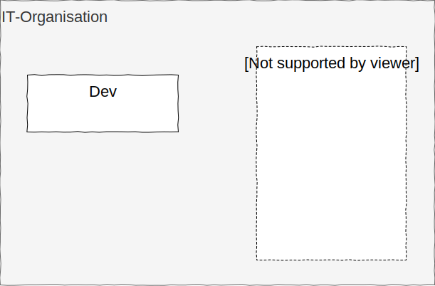

----

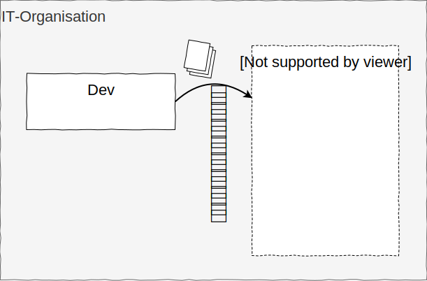

----

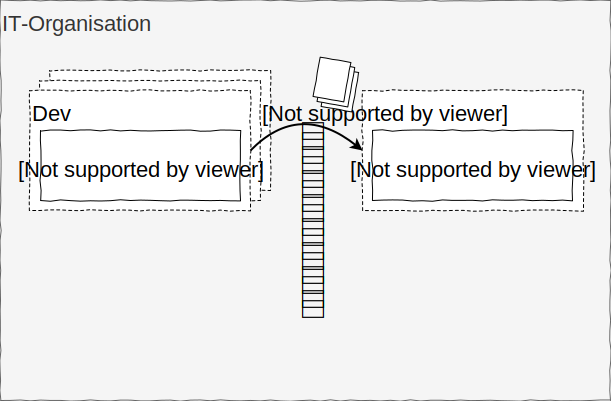

----

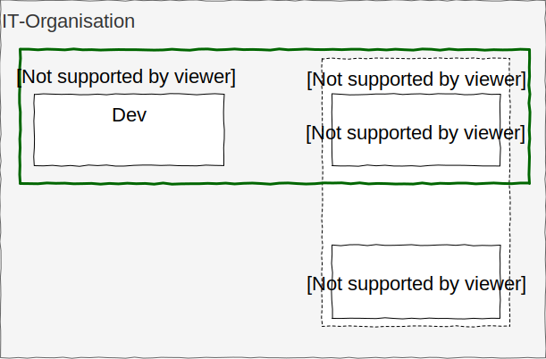

---

## Was tut man da?

----

----

----

----

----

----

----

----

----

Notes:
* die Methoden von Dev auf Ops anwenden:
    * Automatisierung
    * Tests
    * Versionsverwaltung
    * Staging

---
<!-- .slide: class="t-210" -->

## Warum DevOps?

----
<!-- .slide: class="t-210" -->

## Warum DevOps?

### you build it, you run it

----
<!-- .slide: class="t-210" -->

## Warum DevOps?

### you build it, you run it
### speed

---

## Mehr Speed?
## Also Agil?

----

&nbsp;
-----

----

&nbsp;
-----

----

&nbsp;
-----

----

&nbsp;
-----

Notes:
* Agile Teams mit DevOps Kompetenz - BizDevOps

----

Biz
-------

----

BizDev
--------

----

BizDevOps
---------

---

## Wie sieht DevOps heute aus?

----

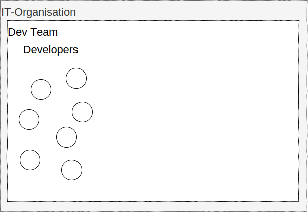

&nbsp;
----------

----

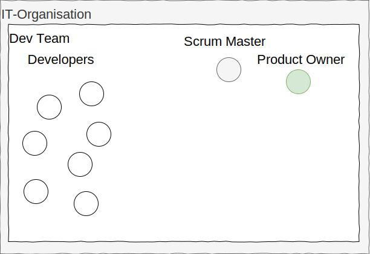

&nbsp;
----------

----

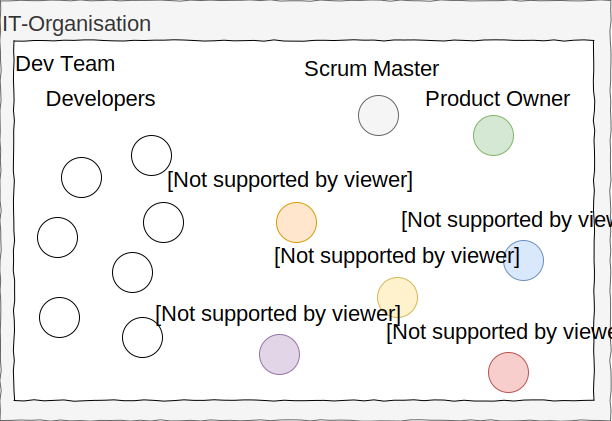

&nbsp;
----------

----

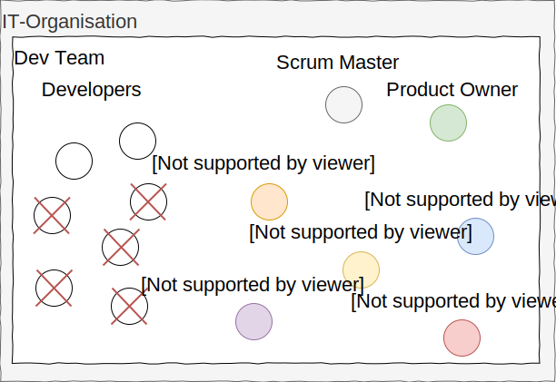

&nbsp;
----------

Notes:
* spezialisierte Rollen anstatt Entwickler

----

Team <= 10
----------

Notes:
* 2-Pizza-Team passt nicht mehr

----

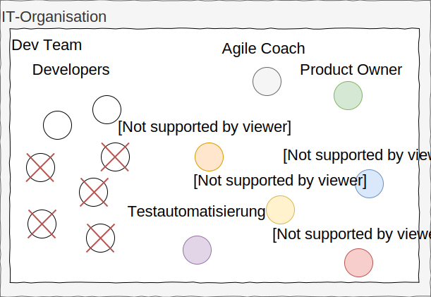

Team <= 10
----------

---

## Wie funktioniert DevOps richtig?

----

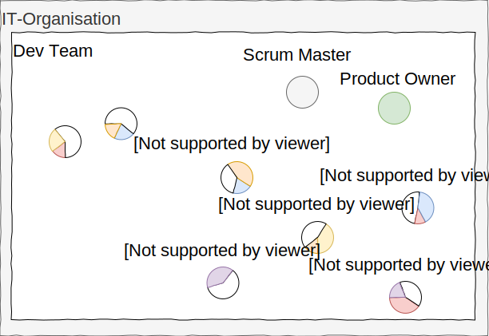

&nbsp;
----------

----

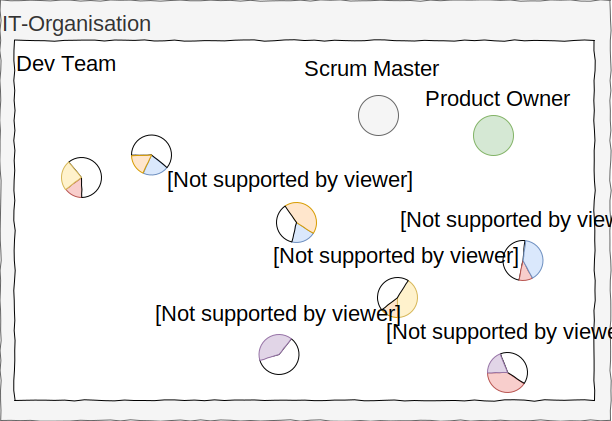

&nbsp;
----------

Notes:
* Entwickler entwickeln heute schon nicht ausschließlich
* Unittests gehören zur Entwicklung als Teil der Testautomatisierung

----

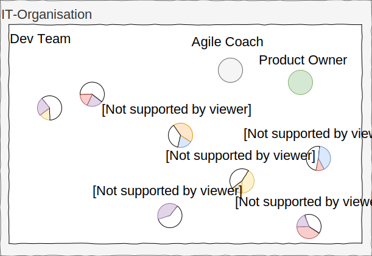

&nbsp;
----------

Notes:
* auch andere querschnittliche Kompetenzen gehören zur Entwicklung
* Generalisten statt Spezialisten
* Entwickler mit meistem Wissen auf einem Gebiet agieren als Champions
* DevOps-Rolle im Team <-> DevOps-fähiges Team

----

Biz
----------------

----

BizUX
----------------

----

BizUXSec
----------------

----

BizUXSecDev
----------------

----

BizUXSecDevQA
----------------

----

BizUXSecDevQAOps
----------------

---

## Was spricht gegen DevOps?

----

### 24/7 Support?

----

----

### Zentrale Infrastruktur?

----

----

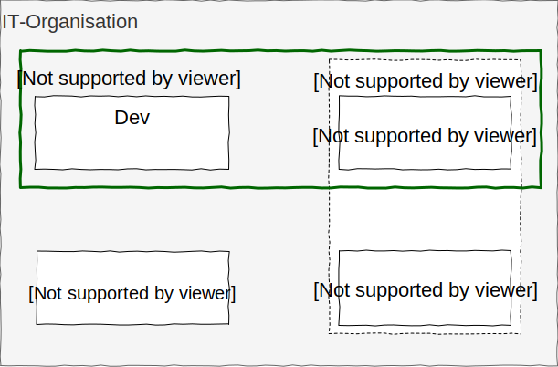

Notes:
* Ops verantwortete bisher Applikationsbetrieb und Infrastruktur

----

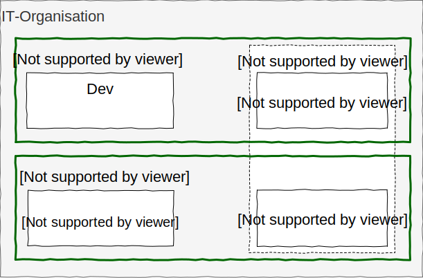

Notes:
* horizontaler Schnitt der Aufgaben

----

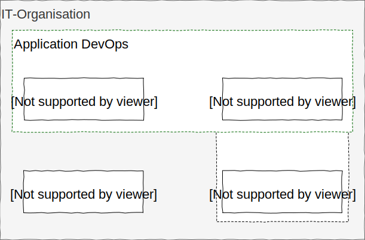

----

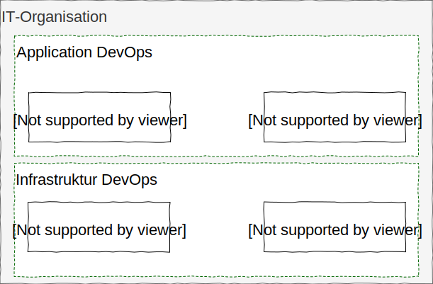

Notes:
* erfordert querschnittliche Kompetenzen
* DevOps wird in Form von Libraries abstrahiert
* Application Team konsumiert Infrastruktur im Self Service

----

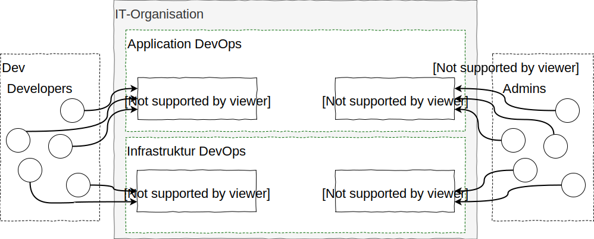

Notes:

---

## Wie komme ich zu DevOps?

----

----

----

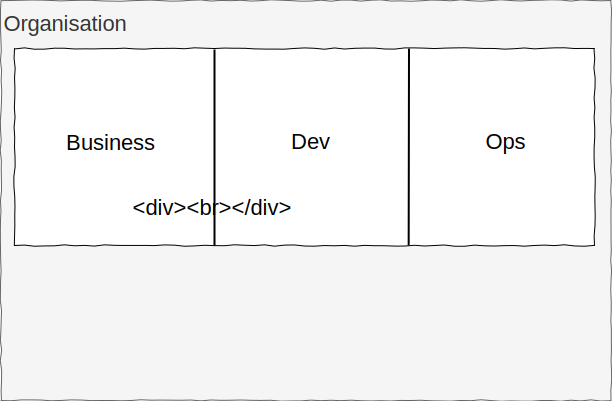

----

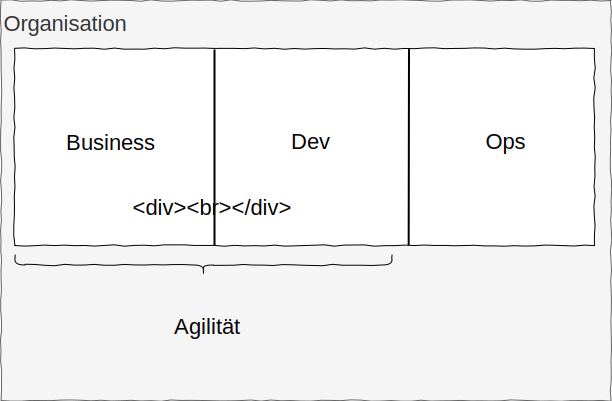

----

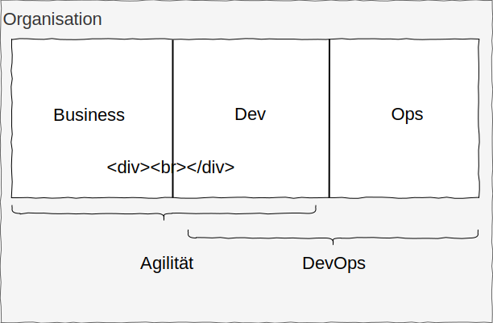

----

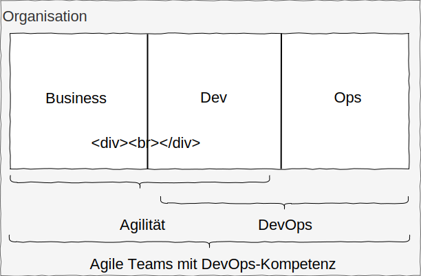

----
<!-- .slide: class="col-2" -->

&nbsp;

----
<!-- .slide: class="col-2" -->

Kamran Ahmed
https://github.com/kamranahmedse/developer-roadmap#devops-roadmap

----
<!-- .slide: class="col-2" -->

Kamran Ahmed
https://github.com/kamranahmedse/developer-roadmap#devops-roadmap
  
Javin Paul
https://hackernoon.com/the-2018-devops-roadmap-31588d8670cb

---

## Noch Fragen?

Steven Berlin @_sberlin 
[steven-sebastian.berlin@iteratec.com](mailto:steven-sebastian.berlin@iteratec.com)

Uwe Bessle @bessi65 
[uwe.bessle@iteratec.com](mailto:uwe.bessle@iteratec.com)

https://iteratec.de/
