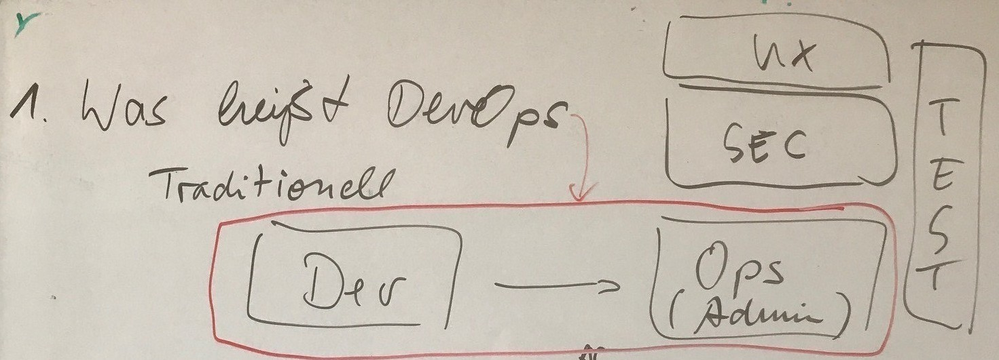
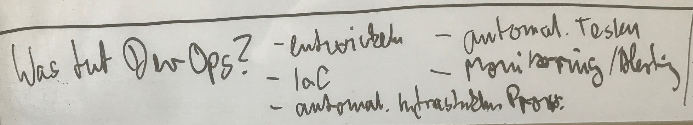
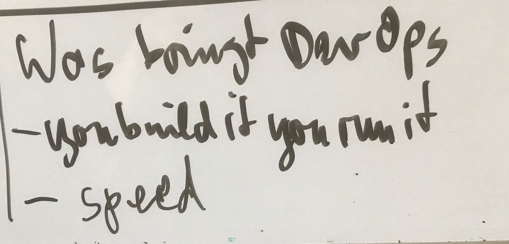
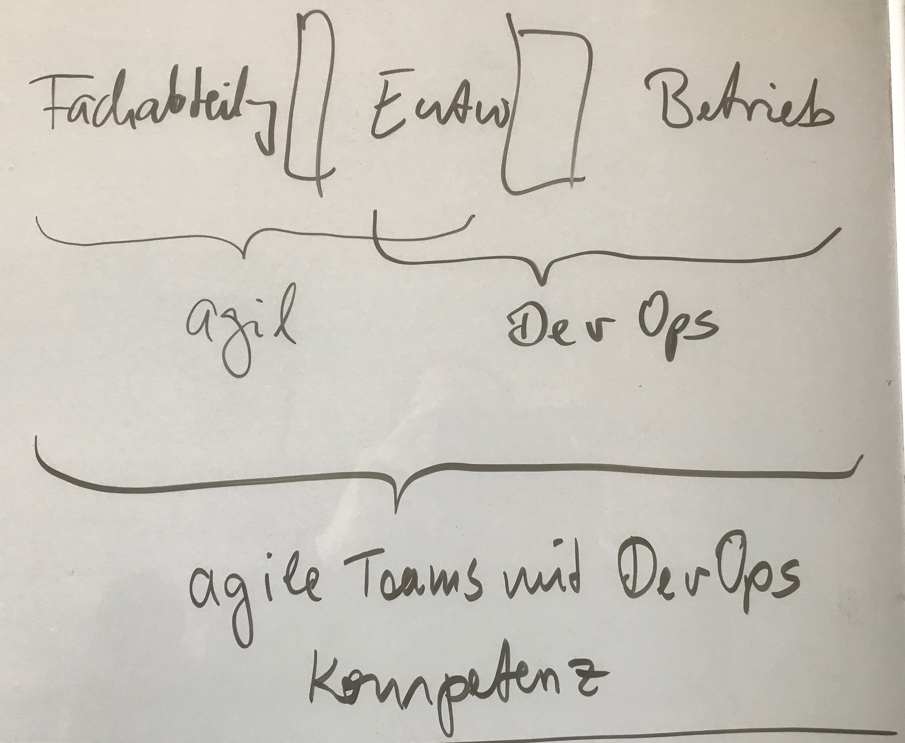
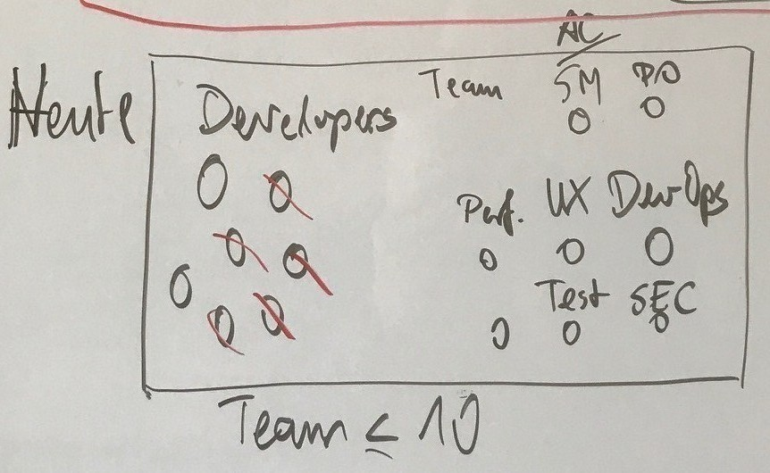
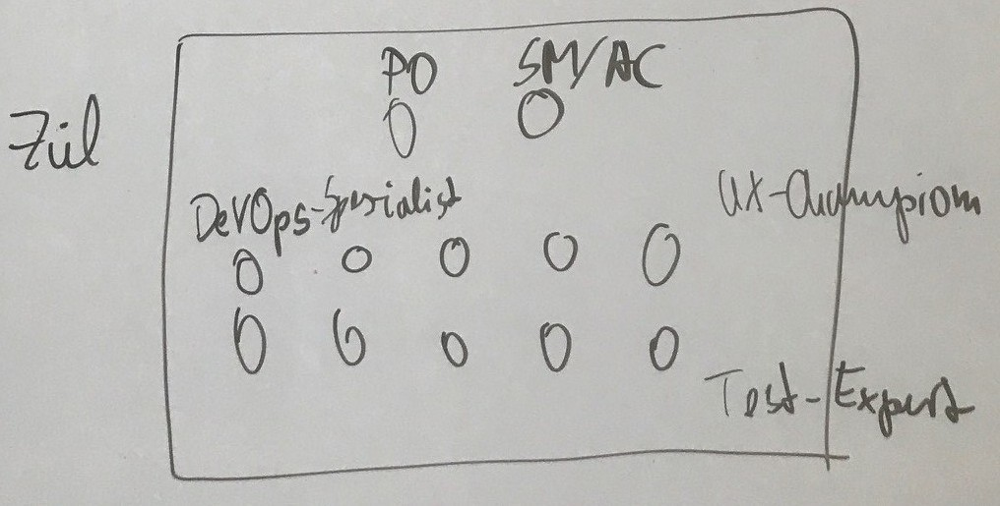
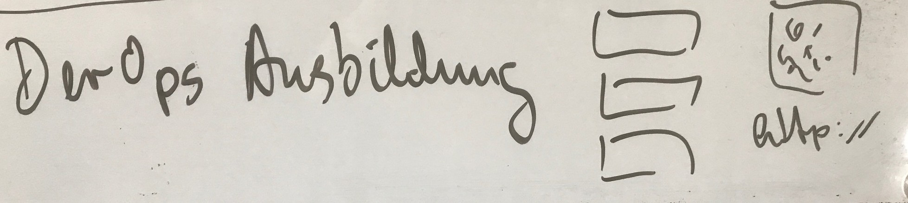
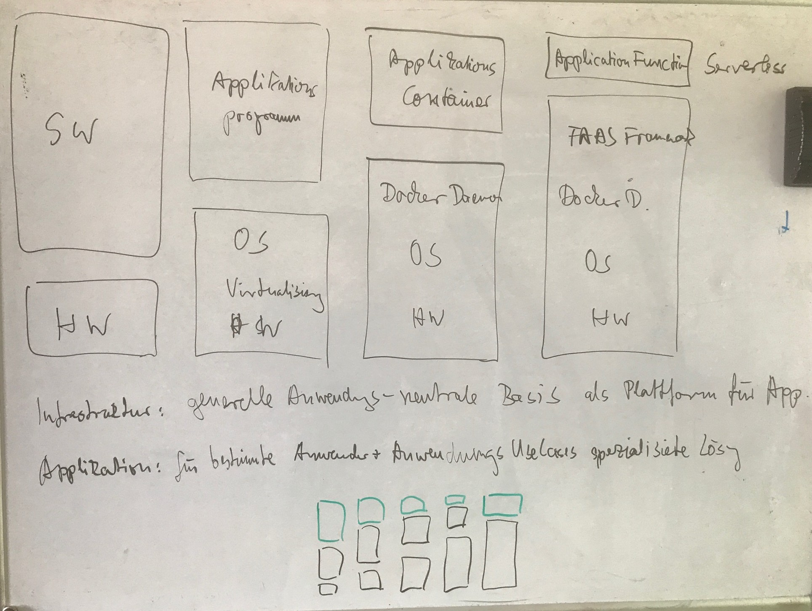

# DevOps - Mehr als nur ein Hype

---

# Was heißt DevOps?

* Was früher getrennt war, zusammenbringen

----

---

# Was tut DevOps?
* die Methoden von Dev auf Ops anwenden:
    * Automatisierung
    * Tests
    * Versionsverwaltung
    * IaC
    * Staging

----

---

# Warum DevOps?

* you build it, you run it
* speed -> agil
* Fachabteilung - Entwicklung - Betrieb
----------------agil--------DevOps-------
* Agile Teams mit DevOps Kompetenz - BizDevOps

----

----

---

# Wie sieht DevOps heute aus?

* spezialisierte Rollen anstatt Entwicklern
* 2-Pizza-Team passt nicht mehr
* für QA ist schon selbstverständlich, dass Entwickler Unittests schreiben

----

---

# Wie funktioniert DevOps richtig?

* lieber: jeder hat querschnittliche Kompetenzen
* DevOps-Rolle im Team <-> DevOps-fähiges Team
* BizSecDevQAOps-Team als Animation mit UX, Performance
* DevOps wird in Form von Libraries abstrahiert

----

----

---

# Wie komme ich zu DevOps?

* https://hackernoon.com/the-2018-devops-roadmap-31588d8670cb
* https://wiki.iteratec.io/display/DEVOPS/DevOps+Ausbildung+bei+iteratec

----

---

# Was ist DevOps nicht?

* 24/7 Support (wartungsarmer vollautomatisierter Betrieb)
* Infrastrukturteams auflösen und auf Teams aufteilen (Applikations- und
  Infrabetrieb)

---

# Was wird aus DevOps?

* Wandel und Verschiebung zwischen Anwendern, Entwicklern und Betreibern

----

